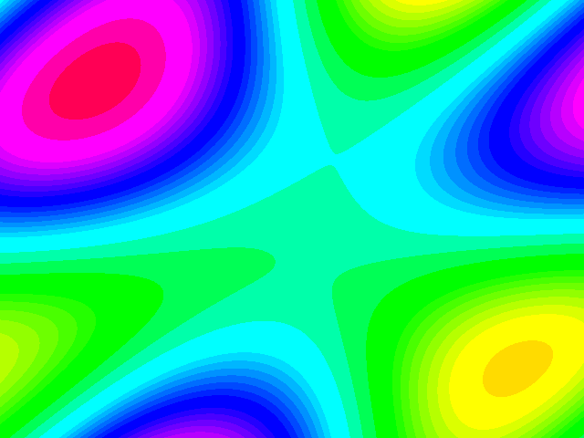

# procedural-gfx-asic

Framebuffer-less procedural graphics accelerator for an RV32IMAC SoC.
Pixels are computed during active scanout instead of stored in SRAM.

Status, 2026-09-25: phases 1 through 3 are done and phase 4 has its first
scene. VGA timing, SMPTE colorbars and the ADV7513 HDMI config walker are
verified in Verilator, and the whole chain has run on real hardware: colorbars
on a monitor off a DE10-Nano, 2026-09-23. The math core, a pipelined CORDIC,
is cross-checked against a Python golden model for all 65536 phases and now
drives a three-grating plasma scene; the current build (D18 DE alignment)
closed timing at worst setup slack +14.012 ns, Slow 1100mV 100C, and ran on
the board 2026-09-25. There is still no RV32 core.

Toolchain (what results are reproduced with):

- Verilator 5.050 for every `make sim*` and `make lint*` target. The CI runner
  uses Ubuntu's apt Verilator, so its exact patch may differ; the numbers quoted
  in the README and docs are measured on 5.050. The sim flow is Verilator-only:
  no Icarus Verilog or Yosys step exists in this repo.
- python3 for the CORDIC golden model (`tb/cordic_golden.py`), which the C++
  testbench reads as its oracle.
- Quartus Prime Standard 25.1 for synthesis, Linux or Windows only. Quartus Pro
  drops the Cyclone V family, so it cannot build this design; Standard needs no
  license for this part.
- A Terasic DE10-Nano (Cyclone V SoC, 5CSEBA6U23I7) to run it on hardware.
  Flashing is optional and covered in [docs/deploy.md](docs/deploy.md).

Reproducing the simulations needs only Verilator and python3: `make sim`,
`sim_i2c`, `sim_config`, `sim_cordic` and `sim_plasma` all run without Quartus
or the board.

## How to read this repo

Start with the status line and the two images below: that is the whole result,
verified in simulation and on the board. For the verification detail, read
[docs/verification.md](docs/verification.md); it lists what each make target
checks and the rules the harnesses follow. For how bugs are found and closed,
read [docs/devlog.md](docs/devlog.md), entries B13 through B17.

*Simulated output: the plasma scene, 60 frames at 640x480 captured from
Verilator (`./obj_dir/sim_plasma +frame=1..60`) and encoded at 20 fps against
a generated 256-color palette with dithering off. The scene uses 29 of the 256
RGB332 codes; all 60 GIF frames are byte-identical to the captures. One frame:
`make sim_plasma` (writes `sim/plasma_frame.ppm`).*

*Simulated output: eight bars at 640x480@60, captured from Verilator to PPM
and converted to PNG (`make sim`). The known-good bring-up reference.*

First bring-up on silicon, 2026-09-23: the same bars on a TV off the
DE10-Nano, through the onboard ADV7513. The phone photo is in the
[v0.1.0 release](https://github.com/avolk201/procedural-gfx-asic/releases/tag/v0.1.0).

Plasma on the OLED, 2026-09-25: [docs/plasma-bring-up.mp4](docs/plasma-bring-up.mp4),
phone video re-encoded to 640x360 H.264 at 30 fps, metadata stripped.

## Quick start

    make lint_top    zero-warning lint of the full top level
    make sim         pixel pipeline, measured timing, one-frame capture
    make sim_i2c     I2C controller against a C++ ADV7513 model, 21 checks
    make sim_config  config walker closed loop, 7 checks
    make sim_cordic  pipelined CORDIC vs the golden model, all 65536 phases
    make sim_plasma  plasma scene look check, one frame to sim/plasma_frame.ppm

Board bring-up, flashing and the LED debug dashboard:
[docs/deploy.md](docs/deploy.md).

## Where this is going

1. Math core: pipelined CORDIC against a Python golden model. Done and
   cross-checked ([docs/cordic.md](docs/cordic.md) has the convergence and
   bit-width argument); it now drives the plasma scene at the top.
2. Real scenes: the plasma is in; next is a DDA raycaster with textures.
3. The namesake: own RV32 core and assembler, memory-mapped scene registers.
4. Storage: SPI SD card with a flat container format, the cartridge.
5. Games: an interactive raycaster demo, then small original games.

Every phase ships a contract doc, a golden model and a self-checking
testbench that has been seen fail at least once. Nothing lands on vibes.

## Docs

Design decisions: [docs/decisions.md](docs/decisions.md).
Bug graveyard: [docs/devlog.md](docs/devlog.md).
Spec references: [docs/references.md](docs/references.md).
Verification methodology and harness inventory: [docs/verification.md](docs/verification.md).
CORDIC math core: [docs/cordic.md](docs/cordic.md).
Board bring-up and flashing: [docs/deploy.md](docs/deploy.md).

## License

MIT. See [LICENSE](LICENSE).
