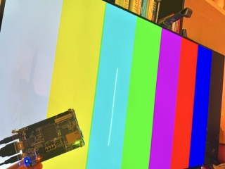

# rv32-apu

Framebuffer-less procedural graphics accelerator for an RV32IMAC SoC.
Pixels are computed during active scanout instead of stored in SRAM.

Work in progress. VGA timing and SMPTE colorbars verified in Verilator
(`make sim`); the I2C controller for ADV7513 HDMI config runs under a
closed-loop protocol testbench (`make sim_i2c`). First hardware bring-up
done 2026-09-23: colorbars on a real monitor off the DE10-Nano.

Design decisions: [docs/decisions.md](docs/decisions.md).
Bug graveyard: [docs/devlog.md](docs/devlog.md).
Spec references: [docs/references.md](docs/references.md).
Verification methodology and harness inventory: [docs/verification.md](docs/verification.md).

## License

MIT. See [LICENSE](LICENSE).
